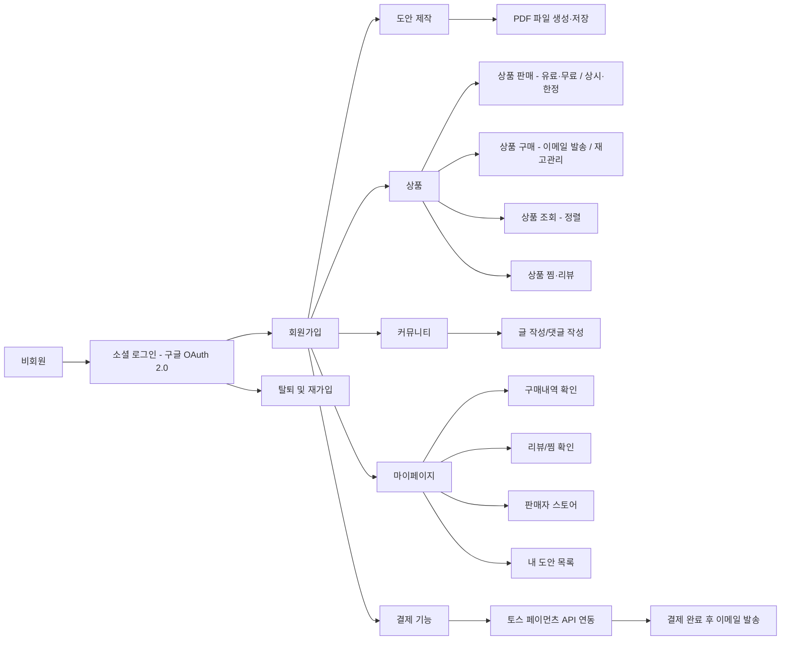

# 🧶 Knitly - Online Knitting Pattern & Community Platform

> 취미로 뜨개질을 즐기는 사람들이 자유롭게 도안을 제작하고 판매하며,
> 서로의 창작물을 공유할 수 있는 커뮤니티 기반 플랫폼입니다.
> 단순한 도안 판매를 넘어, 제작자와 소비자가 함께 성장하는 창작 생태계를 지향합니다.
---
## ✨ 프로젝트 개요

* **프로젝트명:** Knitly
* **주제:** 뜨개질 도안 판매 및 커뮤니티 서비스
* **주제 선정 이유:**
  “취미로 뜨개질을 하는 사람들이 자유롭게 도안을 제작하고 공유할 수 있는 플랫폼이 있으면 좋겠다는 아이디어에서 출발하였습니다.”
* **개발 목표:**

  * 캐싱과 락을 통한 **성능 향상 및 데이터 일관성 확보**
  * 서비스 간 **데이터 흐름 및 비동기 처리 구현**
  * **Redis 기반**의 인기순 조회, 동시성 제어, 찜 기능 관리
  * **외부 API 연동** (토스페이먼츠, OAuth 2.0, PDF 변환 등)
  * **예외 처리 강화 및 테스트 코드 검증**
  * 전체 서비스의 **안정성 및 유지보수성 확보**

---

## 💻 기술적 특징

| 분류                 | 기술 스택                                                   |
| ------------------ | ------------------------------------------------------- |
| **Backend**        | Spring Boot 3.5.x, Java 17, JPA(Hibernate), MySQL       |
| **Infra**          | AWS EC2, Docker, Redis, Nginx                           |
| **API**            | OAuth 2.0 (Google Login), Toss Payments API, Swagger UI |
| **DevOps**         | GitHub Actions (CI/CD), Docker Compose                  |
| **Test & Monitor** | JUnit5, MockMvc, Prometheus, Grafana (검토 중)             |
| **Tooling**        | IntelliJ, Postman, DBeaver, Slack, Notion               |

---

## 🧩 주요 기능 요약

| 구분             | 기능                                           |
| -------------- | -------------------------------------------- |
| **회원가입 / 로그인** | 구글 OAuth 2.0 로그인, JWT 기반 인증/인가               |
| **도안 제작**      | 10x10 격자(Grid) 기반 UI에서 도안 제작 → PDF 변환 저장     |
| **상품 판매**      | 제작한 도안 또는 PDF 업로드 / 무료·한정 판매 지원              |
| **상품 구매**      | Queue 기반 이메일 자동 발송 / Redis 락으로 재고 관리         |
| **상품 조회**      | Redis ZSet으로 인기순 정렬 / 카테고리별·가격순·최신순          |
| **찜 및 리뷰**     | Redis 찜 카운트 / Rabbit Queue 기반 DB 동기화 / 리뷰 작성 |
| **커뮤니티**       | 게시글 및 댓글 CRUD / 소프트 딜리트 기반 관리                |
| **마이페이지**      | 구매내역, 찜목록, 이벤트 참여내역, 구독 관리                   |
| **결제**         | Toss Payments API 연동 / 모의결제 지원               |
| **인증/인가**      | JWT 기반 인증 필터 / 조회 외 모든 API 토큰 검증             |
---

# 팀원
|[김예진](https://github.com/dpwls8984)|[김시현](https://github.com/SiHejt)|[나웅철](https://github.com/No-366)|[부종우](https://github.com/Boojw)|[정혜연](https://github.com/hznnoy)|
|:-:|:-:|:-:|:-:|:-:|
||||||
|BE, FE|BE, FE|BE, FE|BE, FE|BE, FE|

## 🛠️ 역할 분담

| 이름   | 담당 기능 |
|--------|-----------|
| **김예진** | - 상품 구매(Redis, 분산 락) - 상품 판매 |
| **김시현** | - 상품 리뷰 - 상품 찜(Redis & RabbigMQ |
| **나웅철** | - Google 소셜 로그인 - JWT 인증 - 판매자 페이지 |
| **부종우** | - 커뮤니티 글 - 커뮤니티 댓글 - 마이페이지 조회(작성 글/댓글) |
| **정혜연** | - 도안 생성 + PDF 저장 - 도안 조회 - 상품 조회(Redis ZSet) - 상품 결제(토스 페이먼츠 연동)|
---

# 🧩 기능 정의서 (Feature Definition)

## 🧑‍💻 회원가입 / 로그인

- **소셜 로그인 지원**
    - 구글 OAuth 2.0 기반 로그인
    - OAuth 인증 완료 시 프로젝트 내로 리다이렉트
- **회원 정보 수정**
    - 닉네임 / 프로필 이미지 수정 기능 ❌ (비활성)
- **회원 탈퇴 / 재가입**
    - 회원정보 테이블에 `status` 칼럼 추가하여 상태 관리
    - 탈퇴 시 소셜 계정 연결 끊기 로직 포함

---

## 🎨 도안 제작

- 10X10 격자에 기호를 삽입해 도안을 만들고 pdf 파일로 저장
- **프론트엔드**
    - 격자(Grid) UI 기반 도안 제작 화면
    - 사용자의 입력을 `gridData(JSON)` 형태로 백엔드에 전송
- **백엔드**
    - 수신한 `gridData`를 기반으로 PDF 파일 생성 및 저장

---

## 🛍️ 상품 판매

- **판매 대상**
    - 사용자가 직접 제작한 도안 또는 일반 PDF 업로드 가능
- **상품 형태**
    - 유료/무료 도안 + 상시/한정 수량 선택해 도안 상품 판매 지원
- **카테고리 분류**
    - 상의 / 하의 / 아우터 / 가방 / 기타 / 무료 / 한정

---

## 💸 상품 구매

- **구매 프로세스**
    - 사용자는 도안을 구매하면 이메일로 PDF 자동 발송
    - 이메일은 소셜 로그인 계정으로 발송됨
- **비동기 처리**
    - Kafka 대신 **Queue 구조** 사용
    - 큐에 `(사용자 계정, 도안 PDF)` 정보 저장 후 자동 이메일 전송
- **재고 관리**
    - 한정 수량 도안은 **Redis Lock + Queue** 기반 동시성 제어

---

## 🔍 상품 조회

- **정렬 기준**
    - 인기순 (Redis ZSet으로 구매수 기반 정렬)
    - 최신순, 가격순 정렬 지원
    - 메인페이지에서 인기 top5 상품 조회
- **페이징 처리**
    - Spring 서버사이드 렌더링 기반 `Paging` 처리
- **필터링**
    - 카테고리별 / 무료 / 한정 도안 조회 가능

---

## 🤎 **상품 찜 & 리뷰**

- Redis를 이용한 실시간 찜 카운트
- Rabbit 큐를 활용하여 10분마다 DB에 동기화
- 상품별 리뷰 작성 및 확인 가능

---

## 💬 커뮤니티

- **게시판**
    - 단일 게시판 구조
- **게시글 기능**
    - 글 등록 / 수정 / 삭제
- **댓글 기능**
    - 댓글 등록 / 삭제

---

## 🙋 마이페이지

- 찜, 구매내역, 이벤트 참여내역, 구독 관리
- 마이페이지 작성글/댓글 확인

---

## 🧵 판매자 개인 페이지

- **판매자 전용 페이지**
    - 판매중인 도안 목록 및 환영 문구 표시
- **구독 연결**
    - 판매자와 구독 기능 연계 (판매자별 구독 관리)

---

## 🎁 선착순 이벤트 (선택사항)

- **이벤트 생성**
    - 운영진이 직접 생성 (한정수량 / 무료 등)
- **재고 관리**
    - 한정수량 이벤트는 Redis Lock 사용
    - 필요 시 Queue 병행 사용

---

## 📬 구독 기능 (선택사항)

- 판매자를 구독한 사용자는 한 달간 해당 판매자의 모든 도안 다운로드 가능

---

## 💳 결제 기능

- 토스 페이먼츠 API와 연동하여 결제 가능

---

## 🔐 인증 / 인가

- **JWT 기반 인증 적용**
    - 조회(READ) API를 제외한 모든 Controller에 토큰 검증 로직 필수

---

✅ **정리 요약**

- 기술 키워드: `Spring Boot`, `Redis`, `JWT`, `Queue`, `H2`, `MySQL`, `Swagger`, `OAuth 2.0`, `Docker`
- 주요 비동기 처리: **Queue (Kafka 대체)**
- 주요 동시성 제어: **Redis Lock (Lettuce 기반)**
- 데이터 전달 형식: **JSON (gridData, API 응답)**

---

## 📈 성과지표 (Performance Metrics)

| 구분           | 목표                                                       | 상세 내용                   |
| ------------ | -------------------------------------------------------- | ----------------------- |
| **API 응답속도** | 평균 **0.3초 이내**                                           | API 성능 최적화 및 캐싱 활용      |
| **가용성**      | **99.9% 이상**                                             | 장애 감시 및 서버 모니터링 체계 구축   |
| **동시 접속자 수** | **100명 이상 안정 처리**                                        | Redis + Queue 기반 동시성 제어 |
| **데이터 규모**   | 유저 1,000 / 게시글 10,000 / 댓글 20,000 / 상품 1,000 / 주문 10,000 |                         |
| **장애 대응**    | **30분 내 확인 및 대응**                                        | 로그/모니터링 기반 알림 시스템       |
| **운영 안정성**   | **CI/CD 자동화 / 이벤트 중복 0건**                                | 지속적 배포 및 품질 유지          |

---

## 🚀 향후 개선 및 구현 계획

### 🔍 **안정성 · 모니터링 강화**

* SLF4J + Logback 기반 **로그 시스템 신규 구축**
* 주요 이벤트·에러 중심의 **의미 있는 로그 설계**
* **SPOF(단일 장애점)** 식별 및 제거
* **API별 응답시간 모니터링** 도입 (Prometheus / Grafana 검토 중)

### ☁️ **배포 및 인프라 개선**

* **AWS EC2 환경 배포** 진행
* **CI/CD 스크립트 구성**으로 자동 배포 환경 구축 예정

### 🧵 **신규 기능 개발**

* **이벤트 기능** (선착순 쿠폰 이벤트 등)
* **판매자 스토어 구독 기능**
* **AUTO_INCREMENT → Snowflake ID** 방식으로 마이그레이션

### 🧱 **데이터베이스 및 프론트 개선**

* 커뮤니티 / 판매자 스토어 프론트엔드 구현
* 상품 등록 시 이미지 미노출 오류 수정
* 기타 UI/UX 및 기능적 오류 보완
